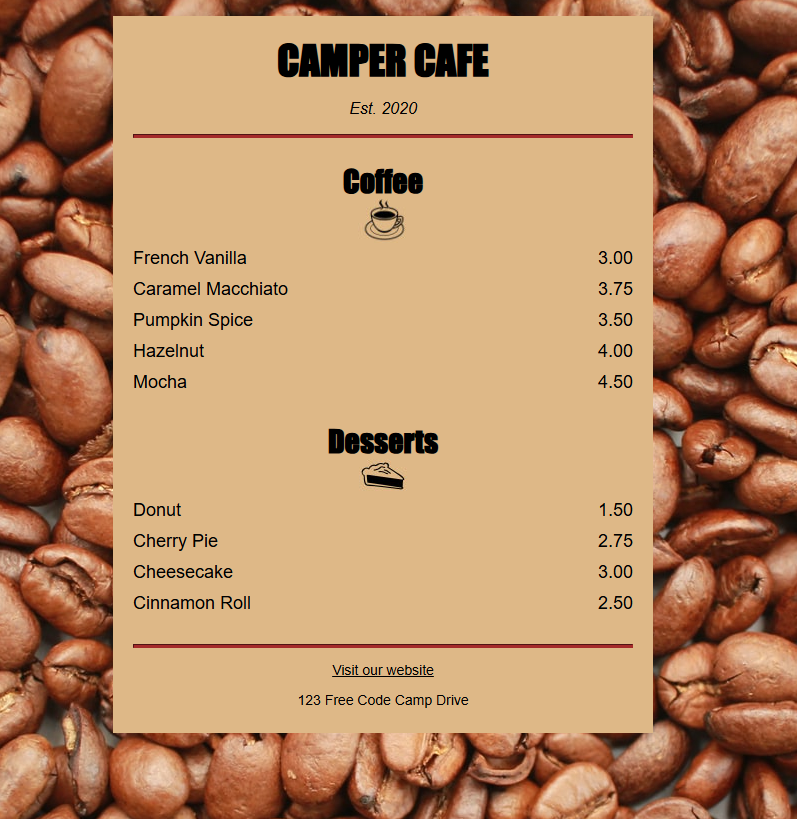

# ☕ 2.1.2 FreeCodeCamp Café Menu

Энэхүү төсөл нь FreeCodeCamp.org сайтын **Responsive Web Design** сургалтын "Café Menu" даалгаврын жишээ код юм.  
HTML болон CSS ашиглан ресторан/кофе шопын меню загвар үүсгэх дадлага юм.

---

## 📸 Демо

🔗 Live Preview: [https://2-1-2-css-freecodecamp-caffee-menu-ane2allt5-baljirs-projects.vercel.app/](https://2-1-2-css-freecodecamp-caffee-menu-ane2allt5-baljirs-projects.vercel.app/)

---

## 🛠 Ашигласан технологи

- HTML5  
- CSS3  
- FreeCodeCamp Responsive Web Design даалгавар  
- Static Site (JavaScript ашиглаагүй)

---

## 📂 Кодыг ашиглах

> 🟡 **Энэ репог клон хийх шаардлагагүй.**  
> Зүгээр эндээс жишээ кодыг уншиж, өөрийн даалгаварт ашиглаарай.

Хүсвэл VS Code дээр `.html` файл үүсгээд кодыг гараар оруулж туршиж болно.

---

## 🌐 Vercel-д Deploy хийх заавар

1. [https://vercel.com](https://vercel.com) руу орж GitHub-ээрээ нэвтэрнэ  
2. **"New Project"** товч дээр дарна  
3. `2.1.2-Css-freecodecamp-Caffee-menu` репо-г сонгоно  
4. **"Deploy"** товч дээр дарна  
5. Ямар ч нэмэлт тохиргоо шаардлагагүй  
6. 10 секундийн дараа сайт тань ажиллана

🎯 Танай Live Site:
👉 [https://2-1-2-css-freecodecamp-caffee-menu-ane2allt5-baljirs-projects.vercel.app/](https://2-1-2-css-freecodecamp-caffee-menu-ane2allt5-baljirs-projects.vercel.app/)

---

## 🧠 Зорилго

- CSS layout, фон, текст стилинг, flexbox зэрэг үндсэн ойлголтыг дадлагажуулах  
- Café/Menu шиг веб загварыг өөрөө гараар бүтээж сурах  
- FreeCodeCamp хөтөлбөрийг бүтээлчээр дагаж хэрэгжүүлэх

---

## 🪪 Лиц
